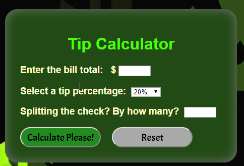

<h1>Challenge-Calculator</h1>

This is my front-end Javascript version of an application to calculate a percentage-based tip for a server. As per the <strong>rules and requirements it:</strong>

* Takes in the value of the bill

* Takes in the desired tip percentage (via drop-down choices)

* Includes the option to split the tip amount by number of people at the table

* Calculates the amount of tip per table (or per person if the split option is chosen) and returns that value to the user(s).

* Has a simple and can be used in the browser. 

AND:
* The bill value is a positive float but handles user input that might be a negative or 0 dollar amount (i.e. error handling) - see additional features.

* The user input percentage for the tip must is a positive float.

* The returned value is a float rounded to two decimal points (i.e. accurate dollars and cents).

<strong>How it works:</strong>
<ol>
<li>Enter the total amount of the bill that you want included in the tip calculation. In other words, if you want to pay tip based on the whole bill, include the whole amount. You can optionally enter the pre-tax amount, or any amount you choose. 

<li>Unless you change the percentage, via the drop-down menu, the tip percentage will be 20%.

<li>If you are not splitting the bill, you can leave the last field blank. Otherwise, enter how many people will split the bill. 

<li>Click the Calculate Please button. See your results!

<li>If at any point you want to start over, click the Reset button.
</ol>

<strong>Additional features:</strong>
<ul>
<li><em>Data validation:</em>
<ul>
<li>Bill total can not be zero, a negative number, blank or text. If these entries are submitted, an error will display. 
<li>The number splitting the check can not be zero, a negative number or text. These entries bill be changed to 1. 
</ul>
<li>Logic used to display "person" or "people" as appropriate in the response.
<li>Cash register sound when Calculate Please is clicked. 
<li>Calculator can be used on a mobile phone.
</ul>
 

